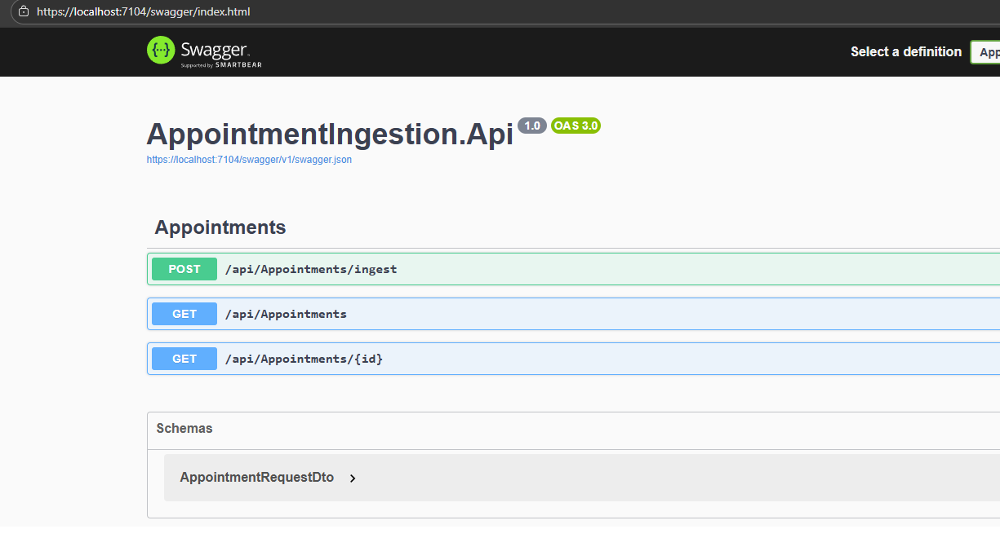
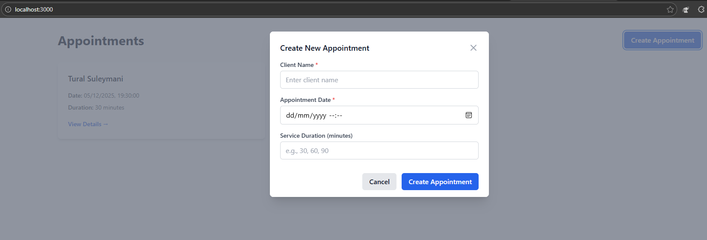

# AppointmentIngestionApp

End-to-end appointment ingestion system built for a case study. Includes a .NET 8 Web API with validation and layered architecture, automated tests, and a React + TypeScript frontend for data submission and live appointment listing.

## 📋 Table of Contents

- [Architecture Overview](#architecture-overview)
- [Prerequisites](#prerequisites)
- [Backend Setup](#backend-setup)
- [Frontend Setup](#frontend-setup)
- [Running Tests](#running-tests)
- [API Documentation](#api-documentation)
- [Project Structure](#project-structure)
- [Design Patterns Used](#design-patterns-used)
- [My podcasts and tutorials related to this repository](#my-podcasts-and-tutorials-related-to-this-repository)
- [Time Breakdown](#time-breakdown)

## 🏗️ Architecture Overview

**Clean Layered Architecture:**
- **API Layer** (`AppointmentIngestion.Api`): ASP.NET Core Web API with controllers and middleware
- **Services Layer** (`AppointmentIngestion.Services`): Business logic, validation, and DTOs
- **Repository Layer** (`AppointmentIngestion.Data`): Core Entities and Database implementation

**Frontend:**
- React 18 + TypeScript
- Zod for schema validation
- React Hook Form for form management
- Tailwind CSS for styling
- Custom hooks for state management

## 📦 Prerequisites

### Backend
- [.NET 8 SDK](https://dotnet.microsoft.com/download/dotnet/8.0)
- Visual Studio 2022 / VS Code / Rider (optional)

### Frontend
- [Node.js 18+](https://nodejs.org/) and npm
- Any modern code editor

## 🚀 Backend Setup

### 1. Clone the Repository
git clone <repository-url> cd AppointmentIngestionApp
cd backend/AppointmentIngestionApp

### 2. Restore Dependencies
dotnet restore

### 3. Build the Solution
dotnet build

### 4. Run the API
cd src/AppointmentIngestion.Api
dotnet run

The API will start at:
- **Url**: `localhost:7104`
- **Swagger UI**: `http://localhost:7104/swagger`

- 

### Alternative: Run from Visual Studio
1. Open `AppointmentIngestionApp.sln`
2. Set `AppointmentIngestion.Api` as startup project
3. Press `F5` or click "Start Debugging"

## 🎨 Frontend Setup

### 1. Navigate to Frontend Directory
cd frontend

### 2. Install Dependencies
npm install

### 3. Configure Environment Variables
Edit `.env` if you need to change the url

### 4. Run Development Server
npm run dev

The frontend will start at:
- **Local**: `http://localhost:3000`

- 
### 5. Build for Production (Optional)

## 🧪 Running Tests

### Backend Tests

**Run All Tests:**
`dotnet test`

**Run with Detailed Output:**
`dotnet test --logger "console;verbosity=detailed"`

**Run with Code Coverage:**
`dotnet test /p:CollectCoverage=true /p:CoverletOutputFormat=opencover`

## 📚 API Documentation

### Endpoints

**Base URL:** `http://localhost:5000/api`

#### Create Appointment
POST `/api/appointments/ingest Content-Type: application/json`
`{ "clientName": "John Doe"
, "appointmentTime": "2025-01-15T14:30:00.000Z"
, "serviceDurationMinutes": 60 }`

**Response (201 Created):**
`{ "id": 1, "message": "Appointment created successfully." }`

#### Get All Appointments
GET `/api/appointments`

**Response (200 OK):**
`[ { "id": 1, "clientName": "John Doe", "appointmentTime": "2025-01-15T14:30:00Z", "serviceDurationMinutes": 60, "status": "Scheduled" } ]`

#### Get Appointment by ID
GET `/api/appointments/{id}`
`{ "id": 1, "clientName": "John Doe", "appointmentTime": "2025-01-15T14:30:00Z", "serviceDurationMinutes": 60, "status": "Scheduled" }`

## Design Patterns Used

This repository showcases the use of several well-known design patterns, providing real-world examples of how they can be applied in a **Domain-Driven Design (DDD)** and **Clean Architecture** context:

### 1. **Result Pattern**
   - **Description**: Encapsulates success or failure outcomes, ensuring error handling is explicit and consistent.
   - **Usage**: Used in handler methods to return meaningful results with error messages.

### 2. **Dependency Injection**
   - **Description**: Provides externalized management of component dependencies, allowing objects to receive required services rather than creating them internally. This ensures loose coupling and improves modularity and testability.
   - **Usage**: Used in services, handlers, and modules to inject repositories, configurations, and external services, enabling clearer separation of concerns and easier unit testing.

### 3. **Mediator Pattern**
   - **Description**: Simplifies communication between components by centralizing interactions.
   - **Usage**: Almost all building block classes act as Mediator.

### 4. **Strategy Pattern**
   - **Description**: Enables selecting algorithms or behaviors at runtime.
   - **Usage**: Injecting most services via contructor

### 5. **Factory Method Pattern**
   - **Description**: Provides a way to instantiate objects while abstracting the creation logic.
   - **Usage**: Used mostly in tests

### 6. **Chain of Responsibility Pattern**
   - **Description**: Passes requests along a chain of handlers until one handles it.
   - **Usage**: Used for applying a series of validation or business rules sequentially.

 ### 7. **Facade Pattern**
   - **Description**: Provides a simplified, unified interface to a complex subsystem, hiding underlying complexities from the client.
   - **Usage**: Used to wrap multiple services or operations behind a single entry point, making interactions easier and reducing coupling between components.

### 8. **Decorator Pattern**
   - **Description**: Allows behavior to be added to objects dynamically by wrapping them in additional functionality without modifying the original class.
   - **Usage**: Used to extend or enhance features for actions for controllers

---

## 🎥 My podcasts and tutorials related to this repository 

To better understand  the concepts mentioned in this repository, check out these related videos from my YouTube channel:

1. **My Podcast with Robert C. Martin: The Creator of Clean Architecture and SOLID Principles**  
   
     
   *In this episode, I sit down with Robert C. Martin (Uncle Bob), the legendary author of Clean Code and Clean Architecture and creator of the SOLID principles, to explore Object-Oriented Programming, software design, and the future of development.*

2. **My Podcast with Mads Torgersen: The Man Behind the C# Language**  
   
     
   *Explore the evolution of C#, its features, and its application in modern software development with the Lead Designer of C# language and of course, with me :).*

3. **A Deep Dive into Architecture, Functional Programming, and Dependency Injection with Mark Seemann**  
   
     
   *In this episode, I chat with renowned software architect Mark Seemann about modern software development, covering topics like well-designed architecture, Dependency Injection, and functional programming.*

4. **Functional programming in C# with Railway-Oriented Programming**  
   
     
      *A detailed explanation of Functional Programming in C#, its use cases,values, and implementation using Railway-Oriented programming*

5. **Master the Result Pattern: The One Video You Must Watch**  
   
     
   *A detailed explanation of the Result pattern, its use cases, and implementation in C# projects.*

---

## ⏱️ Time Breakdown

**Total Time: ~12 hours**

| Task | Duration | Details |
|------|----------|---------|
| **Backend Development** | 5.5 hours | - Project structure setup - Domain entities and repositories - Service layer with validation - API controllers and error handling - Problem Details integration |
| **Frontend Development** | 3 hours | - React + TypeScript setup - Component architecture - API integration with type safety - Form validation with Zod - Responsive UI with Tailwind |
| **Testing** | 2.5 hour | - Unit tests for services - Controller tests with mocking - Validation tests - Test fixtures and data |
| **Documentation** | 0.5 hours | - README.md - JUSTIFICATION.md - Code comments - API documentation |